# ChilizHack - Sports Quest AI Platform

A comprehensive sports quest and rewards platform built on the Chiliz blockchain, featuring AI-powered mission generation, smart contract rewards, and fan engagement tools.

## Architecture

This project consists of three main components:

### 🤖 AI Agent System (`agent_system/`)
**Multi-agent AI backend for sports quest generation**

- **Technology**: Python 3.11+, FastAPI, SQLite
- **Features**: 
  - AI-powered quest generation based on sports events
  - ESPN API integration for real-time sports data
  - Multi-agent architecture with specialized quest generators
  - Automated quest validation and distribution
  - Support for individual, collective, and clash quests

**Key Components:**
- Individual Quest Generator
- Collective Quest Generator  
- Clash Quest Generator
- Event scheduler and database integration
- RESTful API with comprehensive endpoints

#### Agent Workflow Architecture

```mermaid
graph TB
    %% Styles
    classDef input  fill:#fff3c5,stroke:#e0a600,stroke-width:2px;
    classDef tools  fill:#d0e8ff,stroke:#3a7bd5,stroke-width:2px;
    classDef agents fill:#e9d9ff,stroke:#8b5bf1,stroke-width:2px;
    classDef quests fill:#d5ffd8,stroke:#3db552,stroke-width:2px;
    classDef output fill:#fcd9e5,stroke:#d36fa6,stroke-width:2px;

    %% Input
    INPUT["Dynamic Event Generation<br/>Real-time triggers"]:::input

    %% Tools layer
    subgraph T["Tools"]
        direction TB
        A["ESPN MCP<br/>Match data"]:::tools
        B["WebSearchTool<br/>News feed"]:::tools
        C["Sponsor Tool<br/>Priority calls"]:::tools
        D["Quest Tools<br/>Validation"]:::tools
    end

    %% Agents layer
    subgraph W["Agents"]
        direction TB
        E["Individual Agent<br/>News → Sponsor → Quest"]:::agents
        F["Clash Agent<br/>ESPN → Match → Sponsor → Quest"]:::agents
        G["Collective Agent<br/>Global Events → Sponsor → Quest"]:::agents
    end

    %% Quests layer
    subgraph Q["Quests"]
        direction TB
        H["Individual Quests"]:::quests
        I["Clash Quests"]:::quests
        J["Collective Quests"]:::quests
    end

    %% Output
    OUTPUT["All Quests<br/>Generated content"]:::output

    %% Flux principal vertical
    INPUT --> T
    T --> W
    W --> Q
    Q --> OUTPUT
```



**Agent Workflow Details:**
- **Individual Agent**: Analyzes recent team news and creates personalized quests with sponsor integration
- **Clash Agent**: Verifies real matches via ESPN MCP and generates competitive quests between rival teams
- **Collective Agent**: Identifies global football events and creates community-wide quests
- **Sponsor Priority Tool**: Forces systematic integration of sponsors in all generated content

### 🔗 Smart Contracts (`contracts/`)
**Blockchain infrastructure for reward distribution**

- **Technology**: Solidity, Hardhat, OpenZeppelin
- **Network**: Chiliz Spicy Testnet
- **Features**:
  - FAN token rewards management
  - Leaderboard reward distribution
  - Staking mechanisms
  - Secure reward claiming system

**Smart Contracts:**
- `LeaderboardRewards.sol` - Manages top 10 winners with FAN token rewards
- `StakingRewards.sol` - Multi-level staking system with dynamic APY (5%-50%)
- `MockERC20.sol` - Testing utilities for local development

**Key Features:**
- **Secure Reward Distribution**: Anti-reentrancy protection and admin controls
- **Level-based Staking**: 11 levels from Beginner (5% APY) to Immortal (50% APY)
- **Quest Integration**: Staking levels tied to completed quests
- **Comprehensive Testing**: Full test coverage with Hardhat framework

### 🌐 Frontend (`frontend/`)
**Next.js web application for user interaction**

- **Technology**: Next.js 15, TypeScript, Tailwind CSS, Privy Auth
- **Features**:
  - **Web3 Integration**: Privy wallet authentication with Chiliz network support
  - **Mission System**: Real-time quest fetching from AI backend
  - **User Onboarding**: Interactive team selection with visual cards
  - **XP System**: User experience points tracking and management
  - **Leaderboard**: Rankings display with address truncation
  - **Responsive Design**: Mobile-first approach with gradient backgrounds
  - **Dynamic Routing**: `/main`, `/onboarding`, `/leaderboard` pages

**Key Components:**
- `Mission.tsx` - Individual mission cards with corner accents
- `MissionList.tsx` - Grid display of available missions
- `MissionDetail.tsx` - Detailed mission view and completion
- `Navbar.tsx` - Navigation with dual theme support
- `ScrollingBanner.tsx` - Animated promotional content

**API Integration:**
- Fetches missions from `http://89.117.55.209:3001/api/quests/`
- Teams data from `/api/teams/` endpoint
- XP reset functionality via `/api/reset-xp`

## 🚀 Quick Start

### Prerequisites

- Node.js 16+
- Python 3.11+
- Git

### Installation

1. **Clone the repository**
   ```bash
   git clone <repository-url>
   cd chilizHack
   ```

2. **Setup AI Agent System**
   ```bash
   cd agent_system
   pip install -r requirements.txt
   cp .env.example .env  # Add your API keys
   python app.py
   ```

3. **Deploy Smart Contracts**
   ```bash
   cd contracts
   npm install
   npm run compile
   npm run deploy
   ```

4. **Run Frontend**
   ```bash
   cd frontend
   npm install
   npm run dev
   ```

## 🏆 Features

### For Sports Fans
- **Personalized Quests**: AI generates missions based on your favorite teams
- **Real-time Rewards**: Earn FAN tokens for completing challenges
- **Community Engagement**: Join collective quests with fellow supporters
- **Clash Competitions**: Compete against rival team communities
- **Staking Rewards**: Stake FAN tokens for up to 50% APY based on quest completion

### For Developers
- **Multi-agent AI**: Sophisticated quest generation system
- **Smart Contract Integration**: Secure on-chain reward distribution
- **RESTful APIs**: Comprehensive backend services
- **Modern Frontend**: React-based user interface
- **Comprehensive Testing**: Full test coverage across all components

## 📊 How It Works

1. **User Onboarding**: Select favorite teams through interactive interface
2. **Event Detection**: AI monitors sports events via ESPN API
3. **Quest Generation**: Multi-agent system creates personalized missions
4. **Mission Execution**: Users complete quests (tweets, posts, predictions)
5. **Validation**: AI validates quest completion
6. **Reward Distribution**: Smart contracts distribute FAN tokens
7. **Staking Integration**: Users can stake tokens for additional rewards

## 🛠️ Development

### AI Agent System
```bash
cd agent_system
python -m pytest tests/  # Run tests
python app.py            # Start development server
```

### Smart Contracts
```bash
cd contracts
npm test                 # Run contract tests
npm run deploy          # Deploy to testnet
npm run verify          # Verify on explorer
```

### Frontend
```bash
cd frontend
npm run dev             # Development server
npm run build          # Production build
npm run lint           # Code linting
```

## 🌐 API Endpoints

### User Management
- `POST /api/users/register` - User registration
- `GET /api/users/{id}/preferences` - Get user preferences
- `PUT /api/users/{id}/preferences` - Update preferences

### Quest System
- `GET /api/quests/{userId}` - Get user quests
- `POST /api/quests/validate` - Validate quest completion
- `GET /api/quests/collective/{questId}/progress` - Collective progress

### Teams & Events
- `GET /api/teams/exists/{teamName}` - Check team existence
- `GET /api/events` - Get sports events
- `POST /api/sync` - Sync with ESPN data

### Frontend APIs
- `POST /api/missions` - Fetch missions
- `POST /api/reset-xp` - Reset user XP
- `POST /api/transfer` - Handle token transfers

## 🔧 Configuration

### Environment Variables

**Agent System (`agent_system/.env`)**
```env
SPORTDEVS_API_KEY=your_api_key
API_HOST=0.0.0.0
API_PORT=8000
LOG_LEVEL=INFO
ENVIRONMENT=development
```

**Contracts (`contracts/.env`)**
```env
PRIVATE_KEY=your_private_key
```

**Frontend**
```env
NEXT_PUBLIC_PRIVY_APP_ID=cmcz6oibc01epjv0m65jxiobj
```

## 🎯 Smart Contract Addresses

**Chiliz Spicy Testnet:**
- FAN Token: `0x1F0a316ba43224D87d7024C312Ff52E1c8A2CED9`
- LeaderboardRewards: (deployed address saved to `deployment-info.json`)
- StakingRewards: (deployed address saved to `staking-deployment-info.json`)

## 🧪 Testing

Each component includes comprehensive testing:

```bash
# AI Agent System
cd agent_system && python -m pytest tests/

# Smart Contracts  
cd contracts && npm test

# Frontend
cd frontend && npm run test
```

## 📊 Staking Levels

The staking system includes 11 levels with increasing APY:

| Level | Name | Min Quests | APY |
|-------|------|------------|-----|
| 0 | Beginner | 0 | 5% |
| 1 | Novice | 5 | 8% |
| 2 | Amateur | 15 | 12% |
| 3 | Enthusiast | 30 | 16% |
| 4 | Expert | 50 | 20% |
| 5 | Master | 75 | 25% |
| 6 | Legend | 100 | 30% |
| 7 | Champion | 150 | 35% |
| 8 | Hero | 200 | 40% |
| 9 | God | 300 | 45% |
| 10 | Immortal | 500 | 50% |

## 🔒 Security Features

- **Smart Contract Security**: OpenZeppelin contracts with reentrancy protection
- **Access Control**: Owner-only functions for critical operations
- **Input Validation**: Comprehensive parameter checking
- **Anti-double Spending**: Claim tracking to prevent duplicate rewards
- **Secure Authentication**: Privy wallet integration with proper Web3 flows

## 📜 License

MIT License - see LICENSE file for details.

## 🤝 Contributing

1. Fork the repository
2. Create a feature branch
3. Make your changes
4. Add tests
5. Submit a pull request

## 🔗 Links

- [Chiliz Documentation](https://docs.chiliz.com/)
- [ESPN API Documentation](https://www.espn.com/apis/)
- [OpenZeppelin Contracts](https://docs.openzeppelin.com/contracts/)
- [Privy Documentation](https://docs.privy.io/)
- [Next.js Documentation](https://nextjs.org/docs)

---

**Built with ❤️ for the ChilizHack hackathon**
