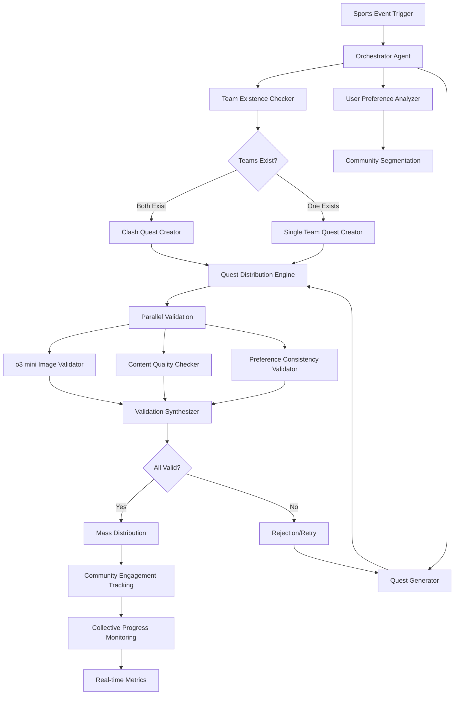

# PRD - Sports Quest AI Backend API

## 1. Product Vision

Develop a backend API system with AI agent that automatically generates personalized quests and missions based on sports events and user-supported teams, with dynamic validation and collective engagement.

## 2. Objectives

- **Primary Goal**: Increase sports fans engagement through automated contextual missions
- **Secondary Goals**:
  - Personalize user experience based on sports preferences
  - Automatically validate mission relevance
  - Facilitate social content creation (tweets, posts) related to sports events
  - Provide REST API endpoints for frontend applications

## 3. Core API Features

### 3.1 User Registration & Preferences API
- **POST /api/users/register** : User onboarding with favorite teams collection
- **GET/PUT /api/users/{id}/preferences** : User profile and supported teams storage
- **POST /api/users/{id}/triggers** : Custom triggers activation based on selected teams
- **GET /api/users/{id}/recommendations** : Additional teams suggestions based on initial preferences

### 3.2 Dynamic Quest System API
- **Input** : Sports events and supported teams (from user profile)
- **Output** : Personalized and contextual missions via API responses
- **GET /api/quests/{userId}** : Fetch user-specific quests
- **POST /api/quests/validate** : Automatic categorization based on context and preferences
- **Quest Generation Logic** : 
  - Only creates quests for teams that exist in the system
  - If PSG vs Madrid event but only PSG exists → create PSG quest for PSG community only
  - If both teams exist → create individual team quests + clash quest
  - **GET /api/teams/exists/{teamName}** : Check if team exists in system
  - **POST /api/quests/conditional-create** : Create quests based on team existence

### 3.3 Mission Generation API
- **GET /api/missions/generate/{teamId}** : Auto-create quests based on favorite teams events
- **GET /api/missions/{userId}/history** : Adaptation based on user profile and sports preferences
- **POST /api/missions/recommend** : Intelligent recommendation system based on engagement history
- Exclusion of non-relevant teams for users

### 3.4 AI Validation API
- **POST /api/validation/content** : Mission relevance verification
- **POST /api/validation/image** : Image validation via o3 mini (quality & appropriateness control)
- **POST /api/validation/text** : Text content quality control before publication
- **GET /api/validation/feedback** : Real-time adaptation based on feedback
- User preference consistency validation

### 3.5 Shared Quest System API
- **POST /api/quests/distribute/{teamId}** : Massive distribution - when quest generated for team, all fans receive it
- **GET /api/community/{teamId}** : Team community belonging via common missions
- **POST /api/quests/clash/create** : Clash Quest Creation Logic:
  - **Requirement** : Both teams must exist in system
  - **Condition** : Sufficient user profiles for both teams
  - **Output** : Creates clash quest "RealvsMadrid" for both communities
  - **Fallback** : If only one team exists, creates single team quest only
- **GET /api/quests/clash/{team1}vs{team2}** : Fetch clash quest between two teams
- **GET /api/engagement/collective** : Collective engagement amplification via group effect

### 3.6 Collective Quests API
- **POST /api/quests/collective/create** : Community objectives ("100,000 PSG tweets before kickoff")
- **GET /api/quests/collective/{questId}/progress** : Real-time collective progress bar visible to all fans
- **GET /api/rewards/collective/{questId}** : Shared rewards - exclusive content unlock for entire community
- **GET /api/challenges/inter-team** : Inter-team challenges ("Who reaches 50k tweets first: PSG or Real?")
- **GET /api/quests/season/{teamId}** : Long-term seasonal collective objectives
- **GET /api/metrics/unified/{teamId}** : Global counting of all team fans actions

## 4. Cas d'Usage

### 4.1 Example: PSG vs Real Madrid Match
**Context** : Event detected via API, team existence check

**Scenario A - Both teams exist in system:**
1. **API Fetch** : "PSG vs Real Madrid tonight" event retrieved
2. **Team Check** : Both PSG and Real Madrid exist in system ✓
3. **Quest Creation** : 
   - Individual PSG quest for PSG community
   - Individual Real Madrid quest for Real Madrid community  
   - Clash quest "PSGvsRealMadrid" for both communities
4. **Distribution** : All PSG fans get PSG quest, All Real fans get Real quest, Both get clash quest
5. **o3 mini Validation** : Image/content control
6. **Execution** : Validated tweets publication

**Scenario B - Only PSG exists in system:**
1. **API Fetch** : "PSG vs Real Madrid tonight" event retrieved
2. **Team Check** : PSG exists ✓, Real Madrid doesn't exist ✗
3. **Quest Creation** : Only PSG quest for PSG community
4. **Distribution** : Only PSG fans receive quest
5. **No Clash Quest** : Cannot create clash without both teams

### 4.2 Exemple de Quête Collective
**Contexte** : Match PSG vs Real Madrid - Objectif communautaire

**Flow** :
1. **Génération Collective** : "Objectif communautaire : 100 000 tweets #PSGMADRID avant le coup d'envoi"
2. **Distribution Massive** : Tous les fans PSG + Real Madrid reçoivent la même quête
3. **Progression Temps Réel** : Barre de progression visible (ex: 45 678/100 000)
4. **Récompense Collective** : Si objectif atteint → déblocage contenu exclusif pour tous
5. **Célébration** : Notification de victoire communautaire envoyée à tous les participants

### 4.3 Exemple de Quête Clash
**Contexte** : Même match - Version compétitive

**Flow** :
1. **Génération Clash** : "Bataille : Qui atteindra 50k tweets en premier ?"
2. **Distribution Opposée** : Fans PSG vs Fans Real Madrid
3. **Compétition** : Course en temps réel avec classement live
4. **Résultat** : Équipe gagnante annoncée + récompenses exclusives

### 4.2 Anticipation d'Événements
**Contexte** : "Paris joue demain"
- Génération proactive de missions d'anticipation
- Préparation de contenu en amont de l'événement

## 5. Architecture Technique

### 5.1 Composants Principaux
- **User Onboarding System** : Team preferences collection during registration
- **User Database** : Profile and team preferences storage
- **Sports API Fetcher** : Automatic sports events retrieval (API TBD)
- **Team Existence Checker** : Validates if teams exist in system before quest creation
- **Trigger Engine** : Event detection based on existing teams and preferences
- **Quest Engine** : Dynamic personalized and clash missions generation
- **Distribution System** : Massive quest sending to team communities
- **Collective Quest Engine** : Community objectives management and real-time progress
- **o3 mini Validation Agent** : Image and content quality control
- **Context Module** : Sports events analysis
- **Competition System** : Clash quests and rankings management
- **User Interface API** : Preferences and actions management

### 5.2 Data Flow
```
Sports API → Fetch Events → Team Existence Check → Quest Generation (Conditional) → Massive Distribution → o3 mini Validation → Community Publication
```

### 5.3 AI Agent Architecture Pattern



## 6. Critères d'Acceptation

### 6.1 Fonctionnalités Critiques
- [ ] Interface d'onboarding pour sélection des équipes favorites
- [ ] Stockage sécurisé des préférences utilisateur
- [ ] Système de triggers basé sur les équipes sélectionnées
- [ ] Détection automatique des événements sportifs pertinents
- [ ] Filtrage des événements selon les préférences utilisateur
- [ ] Génération de missions contextuelles personnalisées
- [ ] Validation IA avec score de pertinence
- [ ] Interface de confirmation utilisateur
- [ ] Système de feedback pour amélioration continue

### 6.2 Performance
- Temps de génération des quêtes < 2 secondes
- Précision de la validation IA > 85%
- Disponibilité du système > 99%

## 7. Métriques de Succès

- **Engagement** : Taux de complétion des missions générées
- **Qualité** : Score de satisfaction utilisateur sur les missions
- **Pertinence** : Ratio missions acceptées / missions générées
- **Rétention** : Utilisation continue du système

## 8. Roadmap

### Phase 1 (MVP)
- Génération basique de missions tweets
- Validation IA simple
- Support pour une équipe

### Phase 2
- Extension multi-équipes
- Missions diversifiées (posts, articles, etc.)
- Amélioration de l'IA de validation

### Phase 3
- Intégration réseaux sociaux multiples
- Analytics avancées
- Communauté et partage entre utilisateurs

## 9. Risques et Mitigation

- **Risque** : Génération de contenu inapproprié
  - **Mitigation** : Validation IA renforcée + modération humaine
- **Risque** : Faible adoption utilisateur
  - **Mitigation** : Tests utilisateurs fréquents + itérations rapides
- **Risque** : Problèmes de performance en temps réel
  - **Mitigation** : Architecture scalable + monitoring proactif