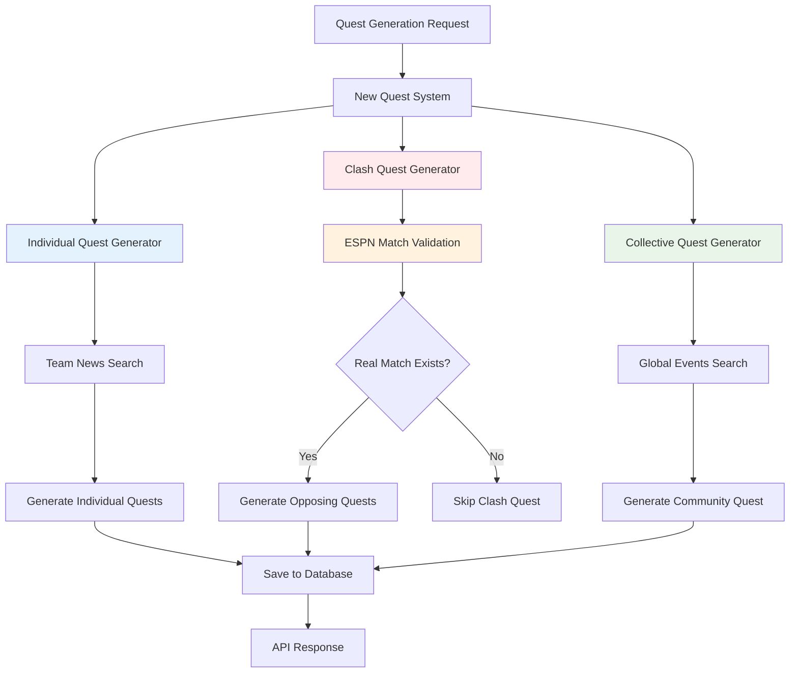
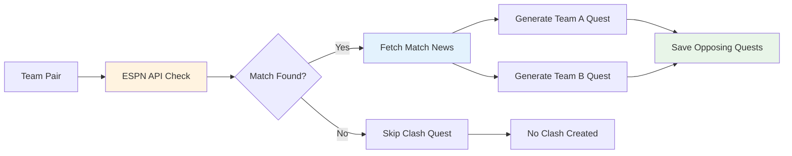
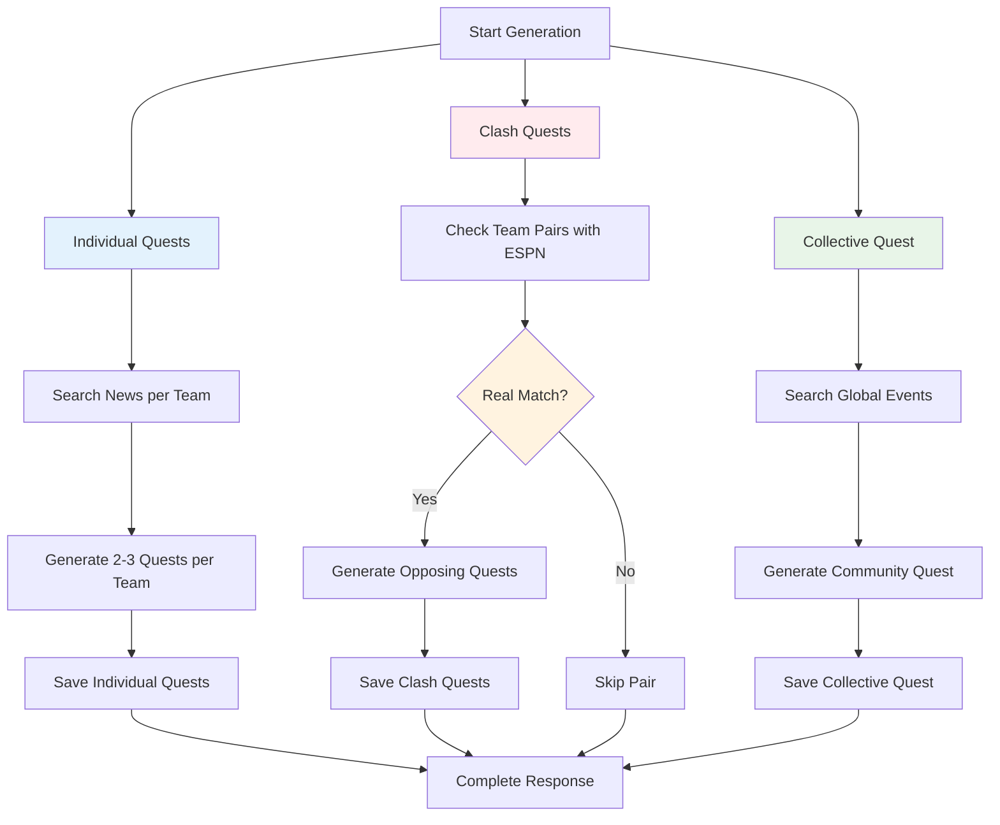

# Sports Quest AI Backend

AI-powered sports quest generation system with multi-agent architecture and ESPN API integration.

## 🏆 Overview

Sports Quest AI automatically generates personalized quests and missions based on sports events and user-supported teams, with dynamic validation and collective engagement. The system implements a complete workflow using multi-agent architecture with real-time sports data from ESPN API.

## 🚀 Key Features

- **Multi-Agent Architecture**: Orchestrated AI agents for intelligent quest generation
- **ESPN Integration**: Real-time sports data and team information
- **Smart Team Detection**: Conditional quest creation based on team existence
- **Quest Types**: Individual, Clash, and Collective quests
- **Multilingual Support**: French, English, and Spanish quest generation
- **User Preferences**: Personalized content based on language and engagement levels
- **AI Validation**: Content quality and appropriateness validation
- **Real-time Distribution**: Massive quest distribution to team communities
- **REST API**: Complete API endpoints for frontend integration

## 🏗️ Architecture

### New Simple Quest System Overview (v3.0)


### Simple Quest Generator Architecture
```
New Quest Generation System
├── Individual Quest Generator
│   ├── News Search Agent (WebSearch)
│   ├── Smart Quest Generation Agent
│   └── Database Save Function
│
├── Clash Quest Generator
│   ├── ESPN API Match Search
│   ├── News Search Agent (WebSearch)
│   ├── Opposing Quest Generation Agent
│   └── Database Save Function
│
├── Collective Quest Generator
│   ├── Global Events Search Agent (WebSearch)
│   ├── Community Quest Generation Agent
│   └── Database Save Function
│
└── Main Generation Endpoint
    ├── Orchestrates All Three Types
    ├── Aggregates Results
    └── Returns Summary
```

### ESPN API Integration
```
ESPN Football Service
├── Team Match Validation
├── Cross-Team Match Detection
├── Match Date Verification
└── Real Match Confirmation
```

### Simple Clash Quest Logic


### Simple Workflow Logic (v3.0)
1. **Individual Quests**: 
   - Search real news for each team
   - Generate 2-3 Community Manager style quests
   - Save with team-specific targeting
2. **Clash Quests**:
   - Check ALL team pairs with ESPN API
   - Only generate if real match exists
   - Create opposing quests for rival teams
3. **Collective Quests**:
   - Search for global football events
   - Generate one community quest for all teams
   - Focus on tournaments and major events

## 📦 Installation

```bash
# Clone repository
git clone <repository-url>
cd agent_system

# Install dependencies
pip install -r requirements.txt

# Setup environment
cp .env.example .env
# Edit .env with your API keys

# Initialize database with sample data (optional)
python -m src.core.init_data

# Run the server
python app.py
```

## 🔧 Configuration

Edit `.env` file:

```env
# API Keys
# ESPN API doesn't require API key

# Database
DATABASE_URL=sqlite+aiosqlite:///./sports_quest.db

# Server
API_HOST=0.0.0.0
API_PORT=8000
LOG_LEVEL=INFO
ENVIRONMENT=development
```

## 📊 API Endpoints

### Essential Quest Generation (v3.0)
- `GET /api/quests/generate/all` - Generate all quest types using new architecture
- `GET /api/quests/new/individual` - Generate individual quests for all teams
- `GET /api/quests/new/clash` - Generate clash quests between team pairs
- `GET /api/quests/new/collective` - Generate one community quest

### Essential Quest Management
- `GET /api/quests/` - Get all quests with filtering
- `GET /api/quests/{user_id}` - Fetch user-specific quests

### Essential Team Management
- `GET /api/teams/` - List teams

## 🎯 Usage Examples

### 1. Complete Quest Generation System (v3.0)

```bash
# Generate all quest types using new simple architecture
curl -X GET "http://localhost:8000/api/quests/generate/all"

# Expected Response: 
# - Individual quests for all teams (based on real news)
# - Clash quests for team pairs (only if real matches exist via ESPN API)
# - One collective quest for global football events
# - Total quests created count and detailed results
```

### 2. Individual Quest Generation

```bash
# Generate individual quests for all teams
curl -X GET "http://localhost:8000/api/quests/new/individual"

# Creates personalized quests based on:
# - Recent team news and updates
# - Player transfers and injuries  
# - Match results and upcoming fixtures
# - Community Manager style descriptions with 1-2 actions max
```

### 3. Clash Quest Generation

```bash
# Generate clash quests between all team pairs
curl -X GET "http://localhost:8000/api/quests/new/clash"

# Only creates clash quests if:
# - ESPN API confirms real upcoming match between teams
# - Both teams have verified match data
# - Creates opposing quests for each team's supporters
# - Uses immersive Community Manager storytelling
```

### 4. Collective Quest Generation

```bash
# Generate one community quest for global football events
curl -X GET "http://localhost:8000/api/quests/new/collective"

# Creates global community quests based on:
# - Major tournaments and finals (World Cup, Euros, Champions League)
# - Transfer deadline days and international matches
# - Global football events that unite all fans
# - Social media actions limited to Twitter only
```

### 5. Quest Management

```bash
# Get all quests with filtering
curl "http://localhost:8000/api/quests/?status=active&quest_type=individual"

# Get user-specific quests
curl "http://localhost:8000/api/quests/1"
```

### 6. Team Management

```bash
# List all teams
curl "http://localhost:8000/api/teams/"
```

## 🤖 New Quest Generation Agents

### Individual Quest Generator
- **News Search Agent**: Fetches current team news and updates
- **Smart Quest Agent**: Generates 2-3 personalized quests per team
- **Community Manager Style**: Immersive storytelling with 1-2 actions max
- **Database Integration**: Saves quests with team targeting

### Clash Quest Generator  
- **ESPN Match Validator**: Confirms real upcoming matches between teams
- **Match News Agent**: Searches for specific match information
- **Opposing Quest Agent**: Creates rival quests for both teams
- **Real Match Logic**: Only generates if ESPN confirms actual match

### Collective Quest Generator
- **Global Events Agent**: Searches for major football tournaments and events
- **Community Quest Agent**: Creates inclusive quests for all fans
- **Global Focus**: World Cup, Euros, Champions League, transfer windows
- **Unity Building**: Quests that unite fans regardless of team allegiance

### Quest Content Rules
- **Social Media**: Twitter only for social media actions
- **Action Limit**: Maximum 1-2 actions per quest
- **Writing Style**: Community Manager immersive storytelling
- **Real Events**: All quests based on actual news and matches

## 🌍 Multilingual Support

### Supported Languages
- **French (FR)**: "🏆 Objectif PSG : Partagez une story Instagram..."
- **English (EN)**: "🔥 Show your support for PSG! Share 5 tweets..."
- **Spanish (ES)**: "🔥 ¡Muestra tu apoyo a Real Madrid! Comparte 5 tweets..."

### Features
- Language-specific quest templates
- Localized hashtags (#AllezPSG, #GoPSG, #VamosPSG)
- Cultural content suggestions
- Engagement level adjustments

## 🎯 New Quest Generation Workflow (v3.0)

### Simple Three-Step Process


### Performance Benefits
- **Simple Architecture**: Direct generation without complex orchestration
- **ESPN Validation**: Real match verification for clash quests
- **Community Manager Style**: Immersive storytelling with action limits
- **Efficient Processing**: Parallel generation of all quest types

## 🏆 Core Scenarios

### Scenario A: Individual Quests Generation
```
Teams: PSG, Real Madrid, Barcelona, Bayern Munich, Chelsea
→ News Search: Fetch recent news for each team
→ Quest Generation: 2-3 Community Manager style quests per team
→ Content: Based on real transfers, matches, player news
→ Actions: 1-2 actions max (Twitter for social media, other actions allowed)
→ Database: Save with team-specific targeting
```

### Scenario B: Clash Quests - Real Match Found
```
Team Pair: PSG vs Chelsea
→ ESPN Check: Real upcoming match found ✓
→ Match News: Search for specific match information
→ Quest Creation: 
  - PSG supporters quest (Team A perspective)
  - Chelsea supporters quest (Team B perspective) 
→ Content: Immersive rivalry storytelling
→ Database: Save opposing quests for both teams
```

### Scenario C: Clash Quests - No Real Match
```
Team Pair: PSG vs Bayern Munich  
→ ESPN Check: No upcoming match found ✗
→ Quest Creation: Skipped (no real match to base rivalry on)
→ Result: No clash quest generated for this pair
```

### Scenario D: Collective Quest
```
Global Events: FIFA Club World Cup 2025, Transfer Window, etc.
→ Events Search: Major tournaments and football events
→ Quest Generation: One community quest for all fans
→ Content: Global football celebration, inclusive for all teams
→ Actions: Twitter for social media, celebration/learning actions
→ Database: Save with team_id=0 for global community
```

## 🚀 Sample Data

The system includes sample data:
- **Teams**: PSG, Real Madrid, Barcelona, Bayern Munich, Manchester United
- **Users**: psg_fan_1 (FR), real_madrid_fan (ES), multi_team_fan (EN)
- **Events**: PSG vs Real Madrid, Barcelona vs Bayern Munich
- **ESPN Integration**: 5/5 teams synchronized, 50 leagues available

## 📁 Project Structure (v3.0)

```
src/
├── ai_agents/          # New Simple Quest Generation Agents
│   ├── individual_quest_generator.py  # Individual quest generation
│   ├── clash_quest_generator.py      # Clash quest with ESPN validation
│   ├── collective_quest_generator.py # Global community quests
│   └── simple_quest_system.py       # Legacy simple system
├── models/              # Database models
│   ├── team.py         # Team model with ESPN integration
│   ├── user.py         # User preferences and language
│   └── quest.py        # Quest storage with metadata
├── services/           # External API integrations
│   ├── espn_football_service.py # ESPN API client with Chelsea support
│   └── database_integration.py # Complete DB operations
├── tools/              # Utilities and helpers
│   ├── database_tools.py # Database operations and quest creation
│   ├── web_search_tools.py # Web search utilities
│   └── team_mapping.py # ESPN team synchronization
├── api/                # FastAPI endpoints
│   ├── main.py        # Main API application
│   └── routes/        # API route handlers
│       ├── quests.py  # Main quest endpoints with generate/all
│       ├── new_quest_generation.py # New quest generation system
│       ├── simple_quest_generation.py # Simple quest routes
│       └── espn.py    # ESPN integration endpoints
└── core/               # Initialization and workflow
```

## 🔍 Testing

### Integration Tests
```bash
# Test complete system integration
python tests/test_complete_integration.py

# Test agent system functionality  
python tests/test_agents_system.py

# Test ESPN API connectivity
python tests/test_working_api.py
```

### Manual Testing
```bash
# Initialize with sample data
python -m src.core.init_data

# Test multilingual workflow
curl -X POST "http://localhost:8000/api/workflow/trigger-event-sync" \
  -H "Content-Type: application/json" \
  -d '{"event_id": 1, "title": "PSG vs Real Madrid", "home_team": "PSG", "away_team": "Real Madrid", "event_date": "2025-07-15T20:00:00Z", "sport": "football"}'
```

## 🔧 Development

- **Framework**: FastAPI + SQLAlchemy (async)
- **Database**: SQLite with ESPN API integration
- **AI**: Multi-agent architecture with intelligent orchestration
- **APIs**: ESPN Football API for real-time sports data
- **Languages**: Python 3.11+ with async/await patterns

## 📈 System Status (v3.0)

### ✅ Completed Features
- [x] **New Simple Architecture**: Direct quest generation with clear separation
- [x] **Individual Quest System**: Real news-based quest generation for each team
- [x] **Clash Quest System**: ESPN-validated real match rivalry quests
- [x] **Collective Quest System**: Global football events community quests
- [x] **ESPN API Integration**: Real match validation and team synchronization
- [x] **Community Manager Style**: Immersive storytelling with action limits
- [x] **Content Rules**: Twitter-only for social media, diverse other actions
- [x] **Database Integration**: Complete quest storage with team targeting
- [x] **API Endpoints**: New quest generation routes with testing capabilities
- [x] **Complete REST API**: Generate all quest types in single endpoint

### 🎯 Key Features (v3.0)
- **Individual Quests**: 2-3 quests per team based on real news
- **Clash Quests**: Only generated for ESPN-confirmed real matches
- **Collective Quests**: One global community quest per generation
- **Content Quality**: Community Manager immersive storytelling
- **Action Limits**: Maximum 1-2 actions per quest for simplicity
- **Social Media**: Twitter-only policy for social media actions
- **Real Data**: All quests based on actual news and match information

### 🏗️ Architecture Benefits
- **Simple Design**: Three separate generators with clear responsibilities
- **ESPN Validation**: Real match confirmation prevents fake clash quests
- **Content Quality**: Community Manager style with immersive storytelling
- **Maintainability**: Modular components with easy testing and debugging
- **Scalability**: Efficient generation with minimal complexity

## 🚀 Production Readiness (v3.0)

The system is **production-ready** with:
- ✅ **Simple Architecture**: Easy to understand and maintain
- ✅ **Real Match Validation**: ESPN API ensures authentic clash quests
- ✅ **Quality Content**: Community Manager storytelling with action limits
- ✅ **Robust ESPN Integration**: Real-time sports data with Chelsea support
- ✅ **Complete API Coverage**: All quest types accessible via REST endpoints
- ✅ **Testing Capabilities**: Individual testing routes for each quest type
- ✅ **Database Integration**: Proper quest storage with team relationships
- ✅ **Content Rules**: Clear guidelines for social media and action types

**Ready for deployment with simplified, high-quality quest generation!** 🚀⚽