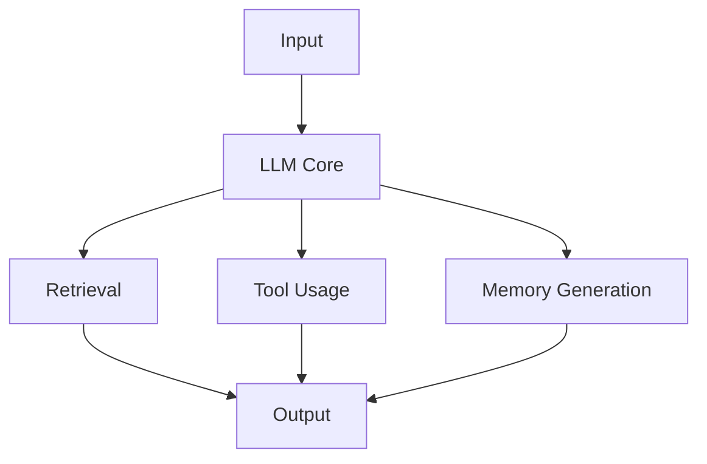
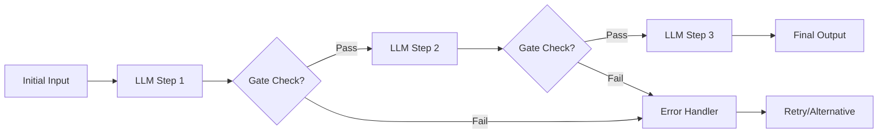
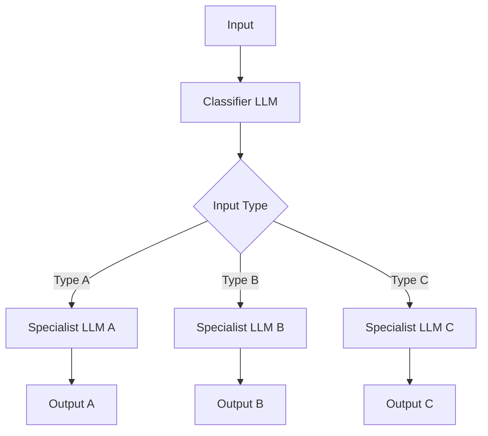
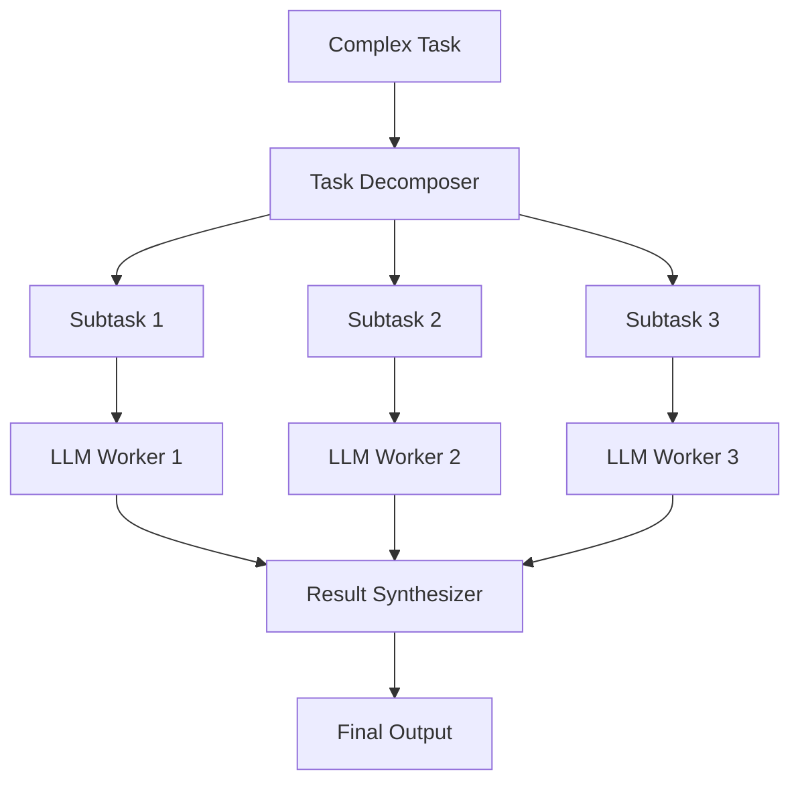
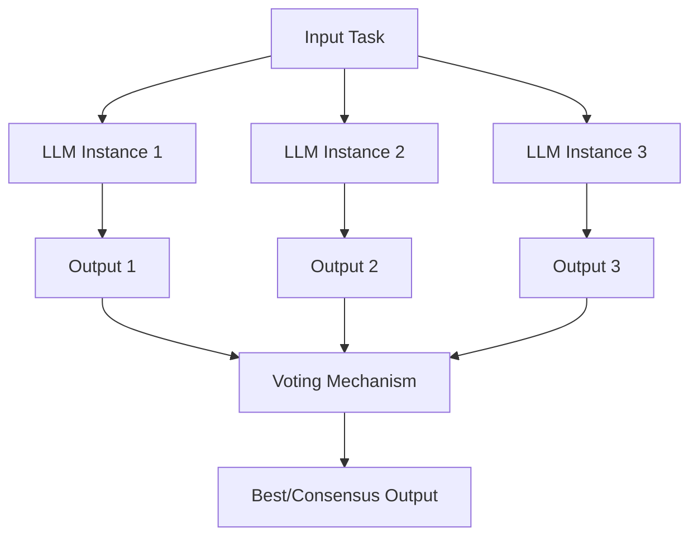
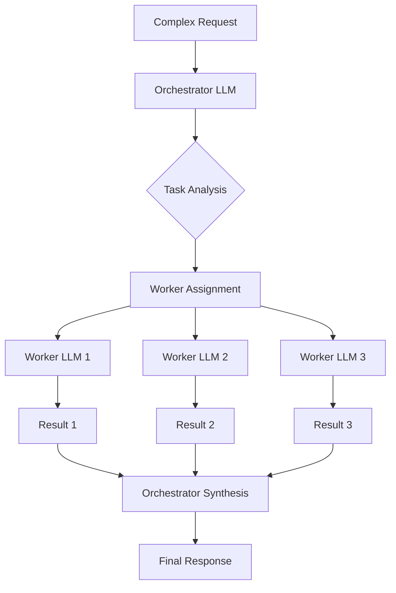
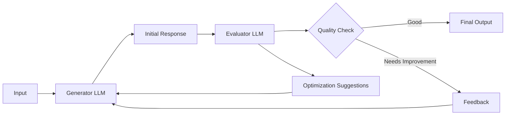
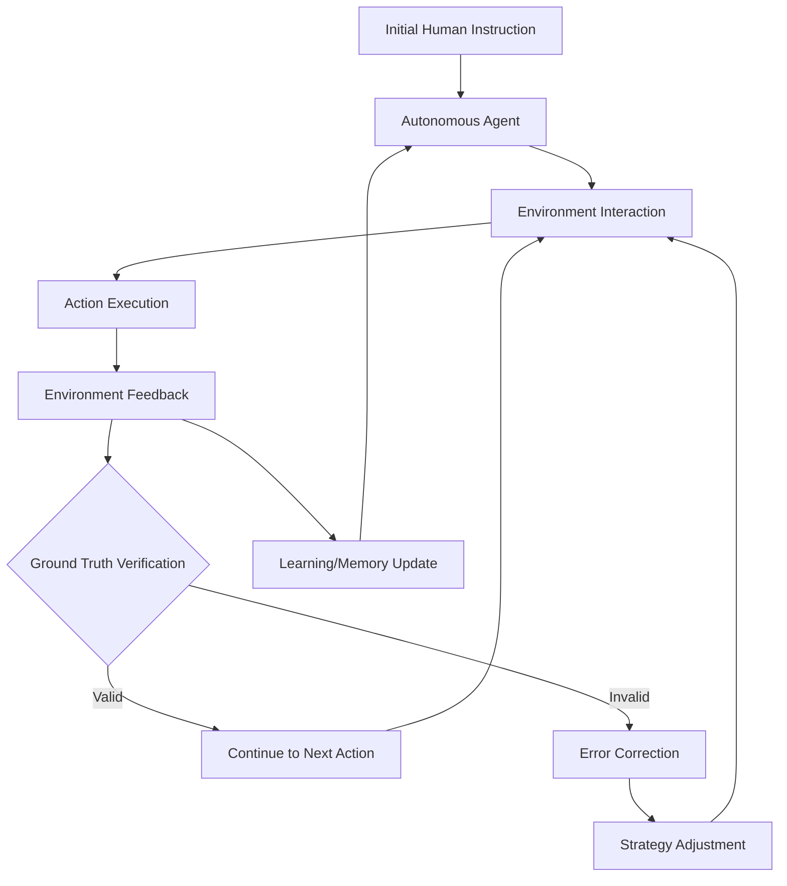
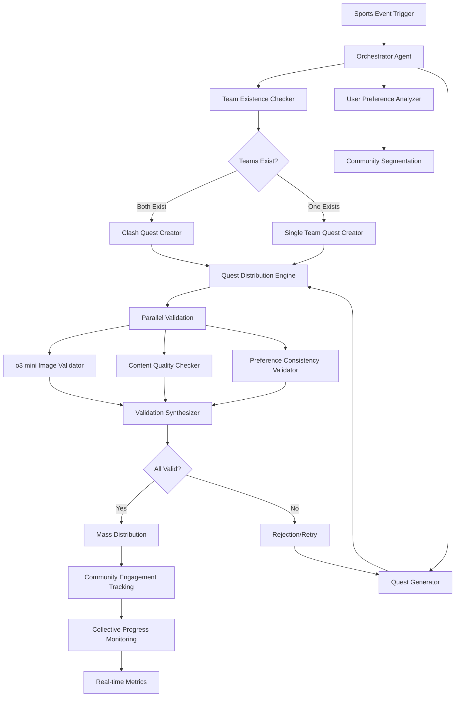

# AI Agent Workflow Patterns - Mermaid Diagrams

## 1. Augmented LLM Building Block

## 2. Prompt Chaining Pattern

## 3. Routing Pattern

## 4. Parallelization Patterns

### 4a. Sectioning

### 4b. Voting

## 5. Orchestrator-Workers Pattern

## 6. Evaluator-Optimizer Pattern

## 7. Autonomous Agent Pattern

## 8. Sports Quest AI System - Applied Pattern

