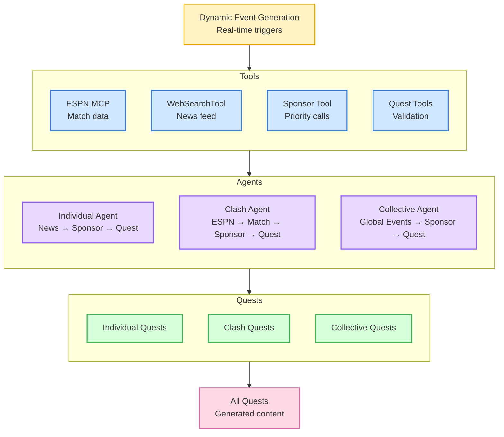

# Sports Quest AI Agent System - Architecture Complète

## 1. Vue d'Ensemble du Système

Le Sports Quest AI Agent System est une plateforme sophistiquée de génération de quêtes dynamiques pour les fans de football utilisant des workflows agentic AI. Le système combine l'intelligence artificielle, les données sportives en temps réel, et l'intégration prioritaire de sponsors pour créer des expériences personnalisées et engageantes. L'architecture est basée sur une API REST qui orchestre trois agents IA spécialisés dans la création de différents types de quêtes : individuelles, compétitives, et communautaires, avec une intégration MCP dédiée pour les données ESPN et un outil sponsor qui force la génération de contenu sponsorisé en priorité.

Le cœur du système repose sur la capacité à analyser les données sportives actuelles, les associer avec des informations de sponsors pertinents, et générer automatiquement du contenu narratif immersif qui résonne avec les passions des fans. Cette approche permet de créer des milliers de quêtes uniques et contextuelles qui évoluent en fonction des événements réels du monde du football.

## 2. Architecture API avec Intégration MCP ESPN

### 2.1 API Endpoints de Génération de Quêtes

Le système fonctionne via une API REST traditionnelle qui expose trois endpoints principaux de génération de quêtes. Cette architecture API permet un déclenchement simple et direct des différents types de génération de quêtes. L'API coordonne les flux de données entre les sources externes, les agents IA, et la base de données.

L'API intègre un serveur MCP spécifiquement pour ESPN qui permet d'accéder aux données sportives en temps réel via le protocole MCP. Cette intégration ESPN-MCP enrichit les capacités du système en fournissant des données de match vérifiées et des informations d'équipes actualisées.

### 2.2 Les Trois Endpoints API + MCP ESPN

**GET /individual** : Cet endpoint déclenche la génération de quêtes personnalisées pour toutes les équipes actives. Il intègre automatiquement les données de sponsors d'équipe pour créer des expériences de marque authentiques. L'endpoint coordonne la recherche d'actualités sportives avec l'identification des sponsors pertinents pour générer 2-3 quêtes contextuelles par équipe.

**GET /clash** : Spécialisé dans la création de quêtes compétitives entre équipes rivales, cet endpoint vérifie d'abord l'existence de vrais matchs via le serveur MCP ESPN avant de générer du contenu. Il intègre les sponsors de match pour créer des activations de marque autour des rivalités sportives. Chaque quête de clash génère deux perspectives opposées pour les fans des équipes adverses.

**GET /collective** : Conçu pour unir la communauté footballistique mondiale, cet endpoint recherche les grands événements footballistiques et crée des quêtes inclusives accessibles à tous les fans, indépendamment de leur affiliation d'équipe. Il intègre les sponsors d'événements majeurs comme les tournois et les cérémonies de remise de prix.

**MCP ESPN Server** : Le serveur MCP dédié à ESPN fournit l'accès en temps réel aux données sportives via le protocole MCP. Il permet la vérification des matchs, la récupération des statistiques d'équipes, et l'accès aux calendriers de fixtures. Cette intégration MCP garantit que les données ESPN sont toujours à jour et accessibles de manière standardisée.

**Outil Sponsor Prioritaire** : L'outil central qui force l'appel automatique des données de sponsors avant chaque génération de quête. Cet outil prioritaire interroge systématiquement la base de données des sponsors pour identifier les campagnes actives et les partenariats pertinents. Il garantit que toutes les quêtes générées intègrent obligatoirement du contenu sponsorisé quand des partenaires sont disponibles, maximisant ainsi les opportunités de monétisation et de visibilité des marques.

## 3. Les Trois Agents IA Spécialisés

### 3.1 Agent de Quêtes Individuelles

L'Agent de Quêtes Individuelles se spécialise dans la création de défis personnalisés basés sur l'actualité récente des équipes. Il utilise le WebSearchTool pour analyser les nouvelles des 7 derniers jours et identifie les événements significatifs comme les buts marqués, les transferts, les blessures, ou les performances remarquables.

L'agent transforme ces informations factuelles en narratifs immersifs qui connectent émotionnellement les fans à leur équipe. Par exemple, si Messi marque un but exceptionnel, l'agent ne se contente pas de mentionner le fait, mais crée une histoire autour de la magie du football et invite les fans à partager leur propre moment de passion. L'intégration des sponsors se fait naturellement, en incorporant les partenaires officiels de l'équipe dans le contexte de la quête.

### 3.2 Agent de Quêtes de Clash

L'Agent de Quêtes de Clash excelle dans la création de défis compétitifs entre équipes rivales. Sa particularité réside dans sa capacité à vérifier l'existence de vrais matchs via le serveur MCP ESPN avant de générer du contenu. Cette approche garantit que toutes les quêtes de rivalité sont basées sur des événements réels et non sur des scénarios fictifs.

Lorsqu'un match est confirmé, l'agent recherche le contexte de la rivalité, l'historique des confrontations, et les enjeux actuels. Il génère ensuite deux quêtes opposées qui capturent les perspectives des fans de chaque équipe. L'intégration des sponsors de match permet de créer des activations de marque authentiques autour de ces moments de haute tension émotionnelle.

### 3.3 Agent de Quêtes Collectives

L'Agent de Quêtes Collectives se concentre sur les événements footballistiques qui transcendent les affiliations d'équipe. Il recherche les grands moments du football mondial : finales de tournois, cérémonies de remise de prix, moments historiques, ou célébrations culturelles du sport.

Cet agent crée des quêtes qui unissent les fans autour de leur amour partagé du football, indépendamment de leurs rivalités habituelles. Par exemple, lors d'une finale de Coupe du Monde, l'agent génère des quêtes qui célèbrent la beauté du sport plutôt que de favoriser une équipe particulière. L'intégration des sponsors d'événements majeurs permet de créer des expériences de marque à grande échelle.

## 4. Workflows Agentic AI et Outil Sponsor Prioritaire

### 4.1 Concept des Workflows Agentic AI

Le système utilise des workflows agentic AI, une approche où les agents d'intelligence artificielle prennent des décisions autonomes et exécutent des tâches complexes en séquence. Contrairement aux systèmes IA traditionnels qui suivent des scripts prédéfinis, les workflows agentic permettent aux agents de s'adapter dynamiquement aux contextes changeants et de prendre des décisions intelligentes basées sur les données disponibles.

Dans notre architecture, chaque agent IA analyse son environnement (données sportives, actualités, sponsors disponibles), prend des décisions sur le type de contenu à générer, et exécute automatiquement les actions nécessaires pour créer des quêtes optimales. Cette approche agentic garantit que chaque quête générée est contextuellement pertinente et maximise l'engagement des utilisateurs.

### 4.2 Outil Sponsor Prioritaire - Mécanisme de Force d'Appel

L'outil sponsor fonctionne selon un mécanisme de "force d'appel" qui garantit l'intégration systématique des sponsors dans toutes les quêtes générées. Cet outil prioritaire intercepte chaque demande de génération de quête et vérifie obligatoirement la disponibilité de sponsors pertinents avant de permettre la création de contenu.

**Mécanisme de Priorisation** :
1. **Appel Automatique Forcé** : Avant chaque génération de quête, l'outil interroge automatiquement la base de données des sponsors
2. **Vérification Obligatoire** : Aucune quête ne peut être générée sans passer par la validation sponsor
3. **Matching Prioritaire** : Les sponsors avec des campagnes actives sont priorisés dans le processus de sélection
4. **Intégration Forcée** : Si des sponsors sont disponibles, leur intégration dans la quête devient obligatoire

**Logique de Priorisation** :
- **Sponsors Premium** : Les partenaires majeurs ont la priorité absolue dans l'allocation de visibilité
- **Campagnes Actives** : Les sponsors avec des campagnes en cours sont systématiquement intégrés
- **Relevance Score** : Un algorithme calcule la pertinence sponsor-contenu pour optimiser l'authenticité
- **Budget Priority** : Les sponsors avec des budgets plus élevés obtiennent une visibilité prioritaire

### 4.3 Génération de Quêtes Sponsorisées en Priorité

L'outil sponsor transforme fondamentalement le processus de génération en priorisant systématiquement le contenu sponsorisé. Cette approche garantit que les opportunités commerciales sont maximisées tout en maintenant la qualité de l'expérience utilisateur.

**Processus de Génération Sponsorisée** :
1. **Détection de Sponsors** : Identification automatique des partenaires pertinents pour chaque contexte
2. **Création de Brief Sponsorisé** : Génération automatique de briefs créatifs intégrant les messages de marque
3. **Validation de Conformité** : Vérification que le contenu respecte les guidelines des sponsors
4. **Optimisation d'Engagement** : Ajustement du contenu pour maximiser l'interaction tout en respectant les objectifs de marque

**Avantages du Système Prioritaire** :
- **Monétisation Optimisée** : Garantit que chaque quête générée contribue aux revenus publicitaires
- **Visibilité Garantie** : Les sponsors obtiennent une exposition systématique et mesurable
- **Authenticité Préservée** : L'intégration intelligente maintient la crédibilité du contenu
- **ROI Sponsor Maximisé** : Les investissements des partenaires sont optimisés par la génération ciblée

## 5. Intégration Intelligente des Sponsors

### 5.1 Système de Matching Contextuel

Le système de sponsors utilise un algorithme de matching contextuel qui analyse le contenu des quêtes pour identifier les partenaires de marque les plus pertinents. Cette approche garantit que l'intégration des sponsors se fait de manière naturelle et authentique, évitant les placements de produits forcés qui pourraient nuire à l'expérience utilisateur.

Le matching prend en compte plusieurs facteurs : les partenariats officiels des équipes, les sponsors des événements spécifiques, les campagnes marketing actives, et même les préférences démographiques des utilisateurs. Par exemple, un sponsor d'équipement sportif sera prioritaire pour les quêtes liées aux performances des joueurs, tandis qu'un sponsor alimentaire sera plus pertinent pour les quêtes de célébration communautaire.

### 5.2 Types de Sponsors et Intégrations

**Sponsors d'Équipe** : Ces partenaires incluent les sponsors de maillot, les sponsors de stade, et les partenaires officiels. Ils sont intégrés dans les quêtes individuelles et de clash pour créer des expériences de marque cohérentes avec l'identité de l'équipe.

**Sponsors de Match** : Activations spécifiques autour des matchs individuels, incluant les sponsors de diffusion, les partenaires de mi-temps, et les sponsors de statistiques. Ils sont particulièrement pertinents pour les quêtes de clash qui capitalisent sur l'excitation des confrontations directes.

**Sponsors d'Événement** : Partenaires des grands tournois, compétitions, et cérémonies. Ils sont intégrés dans les quêtes collectives pour créer des expériences de marque à l'échelle de l'événement entier.

**Sponsors Produit** : Marques d'équipement, de nutrition, et de technologie qui s'alignent avec les valeurs et les besoins des athlètes et des fans. Ils sont intégrés de manière thématique selon le contenu spécifique de chaque quête.

## 6. Pipeline de Génération de Quêtes

### 6.1 Collecte de Contexte

La première étape du pipeline implique la collecte exhaustive de données contextuelles. Le système interroge simultanément plusieurs sources : le serveur MCP ESPN pour les données de match en temps réel, WebSearchTool pour les actualités récentes, et l'outil de sponsors pour les campagnes actives.

Cette collecte multi-source permet de créer un contexte riche qui informe tous les aspects de la génération de quêtes. Les données sont analysées pour identifier les événements significatifs, les tendances émergentes, et les opportunités d'engagement optimal des fans.

### 6.2 Matching Intelligent

Une fois le contexte collecté, le système effectue un matching intelligent entre les différents éléments. Les événements sportifs sont associés aux sponsors pertinents, les actualités sont reliées aux équipes et joueurs concernés, et les opportunités d'engagement sont identifiées.

Cette étape utilise des algorithmes de machine learning pour optimiser la pertinence des associations. Le système apprend continuellement des interactions des utilisateurs pour améliorer la qualité du matching au fil du temps.

### 6.3 Génération de Contenu IA

Les agents IA prennent le relais pour transformer les données structurées en narratifs engageants. Chaque agent applique son expertise spécialisée pour créer du contenu qui résonne avec son audience cible. Les agents utilisent des techniques de storytelling avancées pour créer des descriptions immersives qui transportent les fans dans l'univers de leur passion.

L'intégration des sponsors se fait à cette étape, avec une attention particulière à l'authenticité et à la conformité aux guidelines de marque. Les agents sont entraînés à créer des intégrations de marque qui se sentent naturelles et ajoutent de la valeur à l'expérience utilisateur.

### 6.4 Validation Multi-Niveaux

Le contenu généré passe par plusieurs couches de validation. La validation de contenu vérifie la qualité narrative, la cohérence factuelle, et l'appropriateness du langage. La validation de marque s'assure que tous les sponsors sont représentés conformément à leurs guidelines et que les messages de marque sont cohérents.

Une validation finale vérifie l'engagement potentiel de chaque quête, en s'assurant que les actions demandées sont réalisables et engageantes pour les fans. Cette approche multi-niveaux garantit que seul le contenu de la plus haute qualité atteint les utilisateurs finaux.

## 7. Expérience Utilisateur Enrichie

### 7.1 Quêtes Personnalisées avec Récompenses

L'intégration des sponsors permet d'offrir des récompenses tangibles aux fans qui complètent les quêtes. Ces récompenses vont des produits officiels aux expériences exclusives, en passant par les contenus numériques premium. Cette approche transforme l'engagement passif en participation active avec des bénéfices concrets.

Les récompenses sont adaptées aux préférences des utilisateurs et à leur niveau d'engagement. Les fans les plus actifs peuvent accéder à des récompenses exclusives, tandis que les nouveaux utilisateurs reçoivent des incitations à découvrir la plateforme.

### 7.2 Intégration Seamless

L'objectif principal de l'intégration des sponsors est de maintenir l'authenticité de l'expérience fan. Les marques sont intégrées de manière à enrichir plutôt qu'à interrompre l'expérience. Par exemple, un sponsor d'équipement peut offrir des analyses techniques exclusives sur les performances des joueurs, ajoutant de la valeur éducative à l'engagement.

Cette approche garantit que les fans perçoivent les sponsors comme des partenaires légitimes de leur passion plutôt que comme des intrusions commerciales. L'authenticité est préservée en s'assurant que chaque intégration de sponsor apporte une valeur réelle à l'expérience utilisateur.

## Agentic AI Workflows Schema

